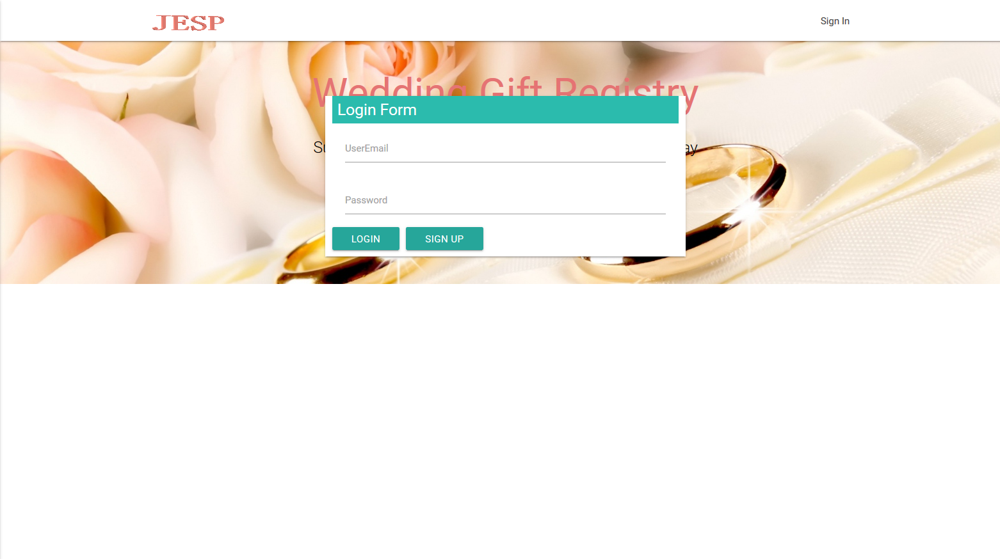
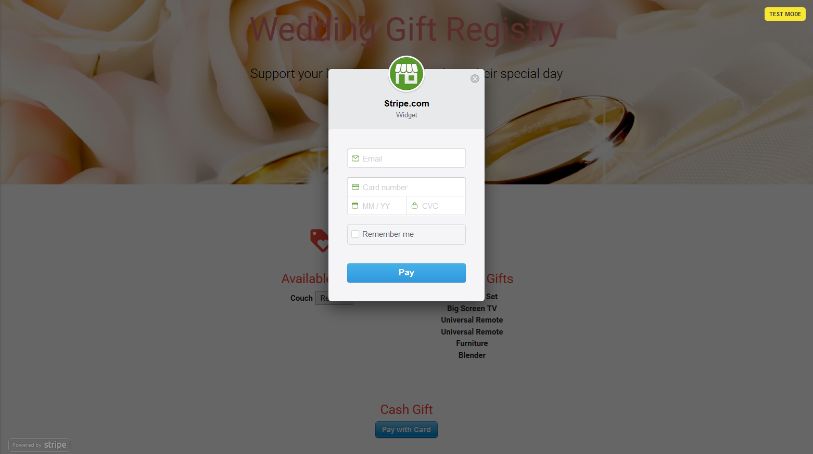

# JESP Wedding Gift Registry

This app was created during mod-15/16 of the DU web dev bootcap 2017/2018. It is a full-stack, Wedding Gift Registry application built with Node, Express, Handlebars, ORM, MySQL, Firebase, Stripe, Nightmare/Mocha/Chai, Heroku, and uses the MVC design pattern.

## Live Site Link
See app: https://gentle-citadel-47852.herokuapp.com/

---

## Screen Shots

### Landing Page

### Login/Sign Up Page

### Host/Gift Entry Page

### Guest Access Page

### Cash Gift Modal

---

## Technologies used
- Node.js - https://nodejs.org/en/
- Express.js - https://expressjs.com/
- Handlebars - http://handlebarsjs.com/
- MySQL - https://www.mysql.com/
- Firebase - https://firebase.google.com/
- Stripe - https://stripe.com/
- Nightmare - http://www.nightmarejs.org/
- Heroku - https://www.heroku.com/
- body-parser NPM Package - https://www.npmjs.com/package/body-parser
- Method-Override NPM Package - https://www.npmjs.com/package/method-override
- Express NPM Package - https://www.npmjs.com/package/express
- Express-Handlebars NPM Package - https://www.npmjs.com/package/express-handlebars
- MySQL NPM Package - https://www.npmjs.com/package/mysql
- Firebase NPM Package - https://www.npmjs.com/package/firebase
- Nightmare NPM Package - https://www.npmjs.com/package/nightmare
- Chai NPM Package - https://www.npmjs.com/package/chai

---

## Developers

* **Jeffrey Phelps** - [Jeffrey Phelps](https://github.com/JeffreyPhelps)
* **Eric Goldstein** - [Eric Goldstein](https://github.com/JeffreyPhelps)
* **Pramila Khanal** - [Pramila Khanal](https://github.com/pramilakhanal)
* **Sam Bouzroud** - [Sam Bouzroud](https://github.com/JeffreyPhelps)